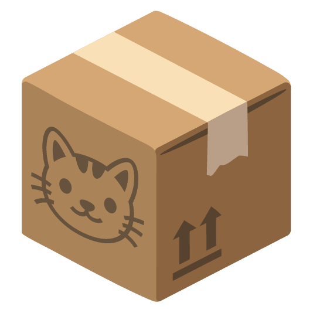

# innbo

a personal home-inventory app



## Prerequisites

- Go 1.24.3
- Flutter 3.44.8
- Docker + Docker Compose

## Local dev

### Backend

```
cp .env.example .env
```
fill in required values, then
```
docker compose up -d --build
docker compose exec backend /server bootstrap-pairing
```

That prints a pairing code, valid 15 minutes.

### Client

```
cd client
flutter pub get
flutter run -d macos   # or an Android emulator/device — see `flutter devices`
```

In the pairing screen, use `http://localhost:8080` (backend) and
`http://localhost:8081` (PowerSync) — or `http://10.0.2.2:PORT` from an
Android emulator, or your machine's LAN IP from a physical device — plus
the printed pairing code.

See [docs/INSTALL-MACOS.md](docs/INSTALL-MACOS.md) if a built `.dmg` is
blocked by Gatekeeper.

## More

- [docs/home-inventory-app-plan.md](docs/home-inventory-app-plan.md) —
  architecture and design decisions
- [docs/adr/](docs/adr/) — why things are the way they are
- [CONTEXT.md](CONTEXT.md) — domain glossary
